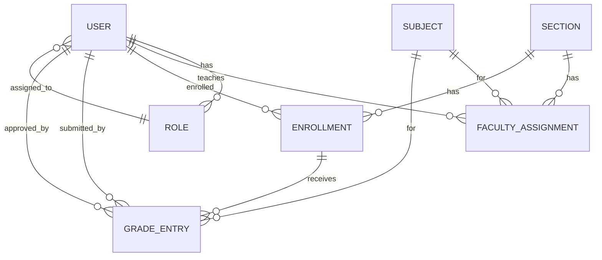
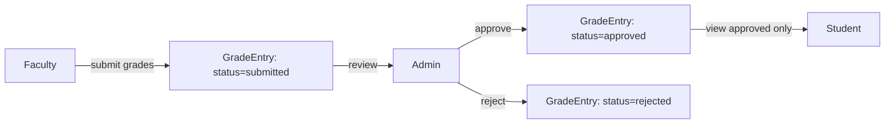

# Grade Workflow — Implementation Notes (2026-01-22)

## Summary
The grade workflow (Faculty submit → Admin approve/reject → Student view approved) is already implemented in the system. Below is a map of **what**, **where**, and **how** it works, plus the ER/flow diagrams for reference.

---

## ER Diagram (Reference)

## Flow Diagram (Reference)

---

## What / Where / How

### 1) Data Model
**What:** `grade_entries` table and `GradeEntry` model for draft/submitted/approved/rejected grades.

**Where:**
- Migration: [database/migrations/2026_01_13_120000_create_grade_entries_table.php](database/migrations/2026_01_13_120000_create_grade_entries_table.php)
- Model: [app/Models/GradeEntry.php](app/Models/GradeEntry.php)

**How:**
- Stores `student_id`, `subject_id`, `term`, `grade_value`, `status`, `created_by`, `submitted_at`, `approved_by`, `approved_at`, `rejection_reason`.
- Status flow: `draft` → `submitted` → `approved|rejected`.

---

### 2) Faculty: Create/Submit Grades
**What:** Faculty can create draft grades, edit, submit for approval.

**Where:**
- Controller: [app/Http/Controllers/Faculty/GradeController.php](app/Http/Controllers/Faculty/GradeController.php)
- Views:
  - List: [resources/views/faculty/grades/index.blade.php](resources/views/faculty/grades/index.blade.php)
  - Create: [resources/views/faculty/grades/create.blade.php](resources/views/faculty/grades/create.blade.php)
  - Edit: [resources/views/faculty/grades/edit.blade.php](resources/views/faculty/grades/edit.blade.php)
- Routes: [routes/web.php](routes/web.php)

**How:**
- `store()` saves grades as `draft`.
- `submit()` sets `status = submitted` and `submitted_at`.
- Access restricted to `faculty|admin` for create/edit; only `draft` can be edited/submitted/deleted.

---

### 3) Admin: Approve/Reject Grades
**What:** Admin reviews submitted grades and approves/rejects with notes.

**Where:**
- Controller: [app/Http/Controllers/Admin/GradeApprovalController.php](app/Http/Controllers/Admin/GradeApprovalController.php)
- Views:
  - List: [resources/views/admin/grade_approvals/index.blade.php](resources/views/admin/grade_approvals/index.blade.php)
  - Detail: [resources/views/admin/grade_approvals/show.blade.php](resources/views/admin/grade_approvals/show.blade.php)
- Routes: [routes/web.php](routes/web.php)

**How:**
- `index()` filters `status = submitted`.
- `approve()` sets `status = approved`, `approved_by`, `approved_at`.
- `reject()` sets `status = rejected` and `rejection_reason`.

---

### 4) Student: View Approved Grades Only
**What:** Students can only view approved grades.

**Where:**
- Controller: [app/Http/Controllers/Student/GradeController.php](app/Http/Controllers/Student/GradeController.php)
- View: [resources/views/student/grades/index.blade.php](resources/views/student/grades/index.blade.php)
- Route: [routes/web.php](routes/web.php)

**How:**
- `index()` filters `student_id = current user` AND `status = approved`.

---

## Notes
- The workflow is functional with the current controllers, routes, and views listed above.
- If you want section/subject assignment enforcement (only assigned faculty can submit for a section), add a `FacultyAssignment` check in the faculty controller.

## Changes Applied (2026-01-22)
1) **Faculty grade entry student selection**
   - **What:** Restricted grade entry to student users and improved the UI to select students by name.
   - **Where:**
     - [app/Http/Controllers/Faculty/GradeController.php](app/Http/Controllers/Faculty/GradeController.php)
     - [resources/views/faculty/grades/create.blade.php](resources/views/faculty/grades/create.blade.php)
     - [resources/views/faculty/grades/edit.blade.php](resources/views/faculty/grades/edit.blade.php)
   - **How:**
     - Validation uses `Rule::exists(...)->where('account_type', 'student')`.
     - Student dropdown replaces raw ID input for create/edit.

2) **Admin approval status enforcement**
   - **What:** Admin can only approve/reject grades in `submitted` status.
   - **Where:** [app/Http/Controllers/Admin/GradeApprovalController.php](app/Http/Controllers/Admin/GradeApprovalController.php)
   - **How:** Guard checks before `approve()` and `reject()` to enforce workflow transitions.

3) **Section-based grade entry shortcut**
   - **What:** Faculty selects a section first; student list is filtered to that section (no manual ID input).
   - **Where:**
     - [app/Http/Controllers/Faculty/GradeController.php](app/Http/Controllers/Faculty/GradeController.php)
     - [resources/views/faculty/grades/create.blade.php](resources/views/faculty/grades/create.blade.php)
     - [resources/views/faculty/grades/edit.blade.php](resources/views/faculty/grades/edit.blade.php)
   - **How:**
     - Added `section_id` field and validation; `student_id` is validated to belong to the selected section.
     - Added a section dropdown and client-side filtering of students by `section_id`.

4) **Admin student list filters (Grade → Section)**
   - **What:** Admin can filter students by grade level first, then section, and view only matching students.
   - **Where:**
     - [app/Http/Controllers/Admin/AdminController.php](app/Http/Controllers/Admin/AdminController.php)
     - [resources/views/admin/accounts/_students_table.blade.php](resources/views/admin/accounts/_students_table.blade.php)
     - [resources/js/student-sections.js](resources/js/student-sections.js)
   - **How:**
     - Added query filters for `student_grade_level` and `student_section_id` with `withQueryString()` for pagination.
     - Added Grade/Section filter UI above the students table.
     - Added JS that loads sections by grade via `/admin/sections/by-grade`.

5) **Removed bulk assign students to sections (Admin)**
   - **What:** Removed the bulk assign UI and checkbox workflow from the Students tab.
   - **Where:**
     - [resources/views/admin/accounts/_students_table.blade.php](resources/views/admin/accounts/_students_table.blade.php)
     - [resources/js/student-sections.js](resources/js/student-sections.js)
   - **How:**
     - Removed the bulk assign form and per-row bulk checkboxes.
     - Removed select-all and bulk count logic from the JS.

6) **Student grades link (Student role)**
   - **What:** Added a navigation entry for students to view approved grades.
   - **Where:**
     - [resources/views/partials/student-sidebar.blade.php](resources/views/partials/student-sidebar.blade.php)
   - **How:**
     - Added `View Grades` link pointing to `student.grades.index`.

7) **Admin approvals list visibility**
   - **What:** Show submitted grades inside the Approve Grades page so admins can review/approve.
   - **Where:**
     - [resources/views/admin/grade_approvals/index.blade.php](resources/views/admin/grade_approvals/index.blade.php)
   - **How:**
     - Replaced the `Recent Activity` block with a submitted grades table and review action.

8) **Faculty assignment department restriction**
   - **What:** Limit assignable faculty departments to available subjects in the portal.
   - **Where:**
     - [app/Http/Controllers/Admin/FacultyAssignmentController.php](app/Http/Controllers/Admin/FacultyAssignmentController.php)
     - [resources/views/admin/faculty_assignments/edit.blade.php](resources/views/admin/faculty_assignments/edit.blade.php)
   - **How:**
     - Populated department options from subjects and validated against that list.
     - Replaced free-text input with a dropdown selection.

9) **Manual student selection checkbox (Sections)**
   - **What:** Made per-student checkboxes explicit in the Add Students to Section table so manual selection is clear.
   - **Where:**
     - [resources/views/admin/sections/show.blade.php](resources/views/admin/sections/show.blade.php)
   - **How:**
     - Added a visible Select column and labels for each row checkbox.
